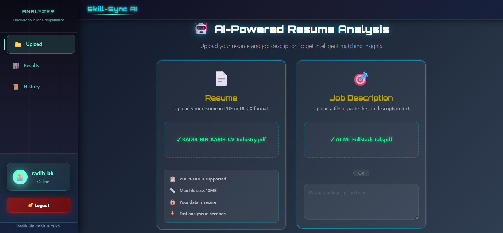
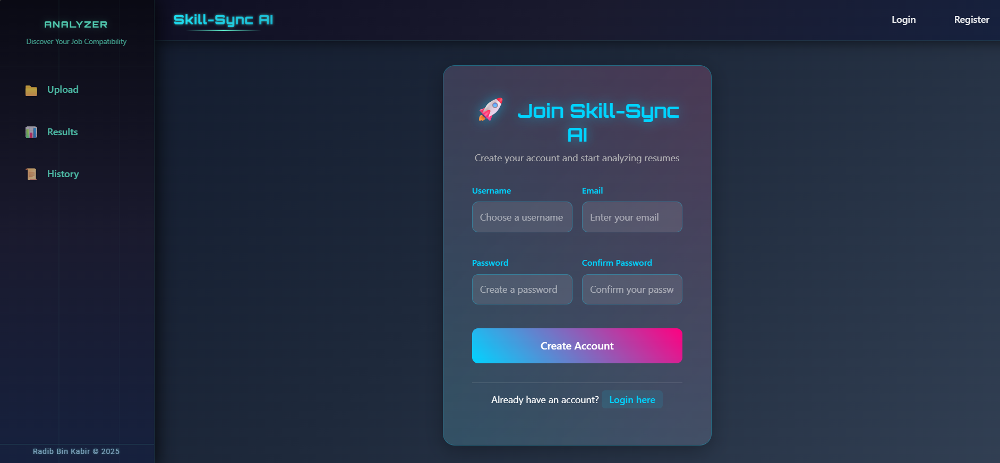
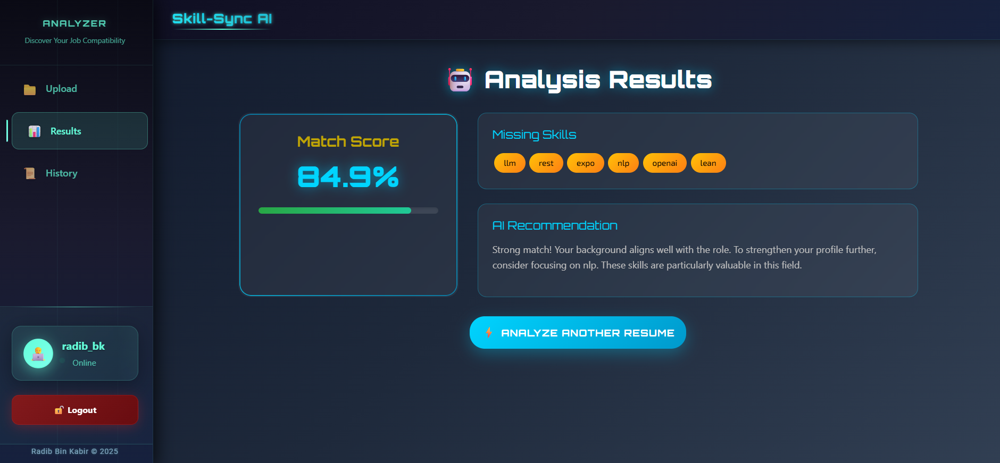
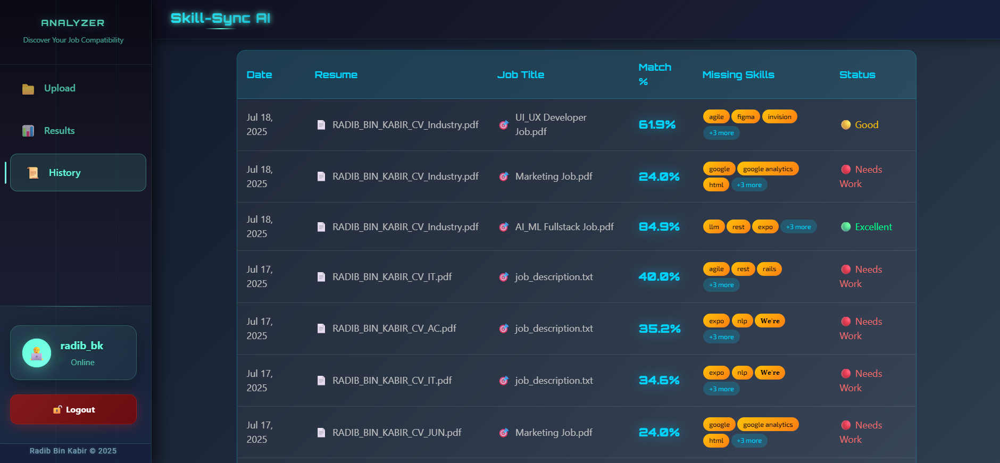
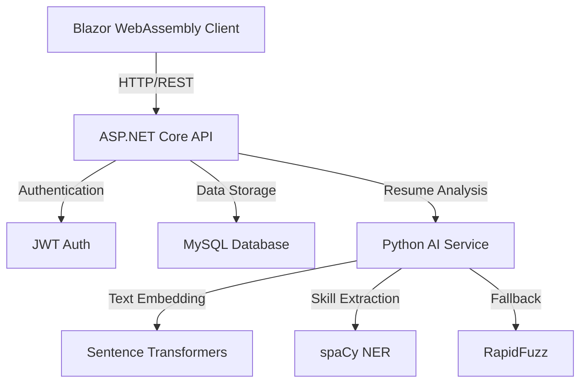

# SkillSync AI - Smart Resume Analyzer

<div align="center">

A modern, AI-powered resume analysis system that helps match candidates with job requirements using advanced NLP and domain-specific scoring.

</div>

## 🚀 Live Demo

<div align="center">

### 🌐 **[Try SkillSync AI Live →](https://radib-bk.github.io/Skill-Sync-AI/)**

*Experience the power of AI-driven resume analysis in real-time*

[](https://radib-bk.github.io/Skill-Sync-AI/)
[](https://radib-bk.github.io/Skill-Sync-AI/)
[](https://radib-bk.github.io/Skill-Sync-AI/)

</div>

## 📸 Screenshots

<div align="center">

### Dashboard


### Register Page


### Analysis Result Page


### History View


</div>

## 🌟 Features

### Smart Resume Analysis
- **AI-Powered Matching**: Uses advanced NLP to understand both resumes and job descriptions
- **Domain-Aware Scoring**: Considers 25+ industry domains for better matching accuracy
- **Experience Level Detection**: Automatically detects and matches candidate experience levels
- **Comprehensive Skill Detection**: Identifies technical, soft, and domain-specific skills
- **Smart Recommendations**: Provides targeted suggestions for skill improvement

### User Features
- **Secure Authentication**: Full user authentication system
- **History Tracking**: Save and track analysis results
- **Modern UI**: Clean, responsive Blazor-based interface
- **Cross-Platform**: Works on all modern browsers

## 🛠️ Technology Stack

### Frontend (C# / Blazor WebAssembly)
- **Language**: C# 12
- **Framework**: .NET 8.0 Blazor WebAssembly
- **UI Components**: Custom-built modern components
- **Styling**: CSS with modern animations
- **State Management**: Built-in Blazor state management

### Backend (C# / ASP.NET Core)
- **Language**: C# 12
- **Framework**: .NET 8.0 ASP.NET Core
- **ORM**: Entity Framework Core 8.0
- **Database**: MySQL with EF Core
- **Authentication**: JWT-based authentication
- **API Documentation**: Swagger/OpenAPI

### Shared (C#)
- **Models**: Shared C# class library
- **DTOs**: Cross-platform data transfer objects
- **Validation**: Shared validation logic

### AI Service (Python)
- **Framework**: FastAPI
- **AI Models**: 
  - Sentence Transformers (`all-MiniLM-L6-v2`)
  - spaCy NER (`en_core_web_sm`)
- **Fallback System**: RapidFuzz for text matching
- **Performance**: Caching and optimization for quick results

## 📊 Architecture



## ☁️ Deployment Architecture

### 🔵 Microsoft Azure
- **Frontend**: Blazor WebAssembly app deployed on **GitHub Pages** with Azure CDN
- **Backend API**: ASP.NET Core API hosted on **Azure App Service**
- **Database**: MySQL database on **Azure Database for MySQL**
- **SSL/TLS**: Managed certificates for secure HTTPS connections
- **Scaling**: Auto-scaling enabled based on demand

### 🤗 Huggingface Spaces
- **AI Service**: FastAPI-based AI service deployed on **Huggingface Spaces**
- **Models**: 
  - Sentence Transformers (`all-MiniLM-L6-v2`) for semantic similarity
  - spaCy NER (`en_core_web_sm`) for named entity recognition
- **GPU Support**: Optimized for CPU inference with potential GPU acceleration
- **Caching**: Model caching for improved response times

### 🔄 CI/CD Pipeline
- **GitHub Actions**: Automated deployment pipeline
- **Azure DevOps**: Continuous integration and deployment
- **Environment Management**: Separate staging and production environments

## 🚀 Getting Started

### Prerequisites
- .NET 8.0 SDK
- Python 3.8+
- MySQL Server
- 2GB+ RAM
- CPU with AVX2 support (recommended)

### Installation

1. **Clone the Repository**
   ```bash
   git clone https://github.com/yourusername/SkillSync-AI.git
   cd SkillSync-AI
   ```

2. **Setup Database**
   ```bash
   cd ResumeAnalyzer.Api
   dotnet ef database update
   ```

3. **Setup AI Service**
   ```bash
   cd ../ResumeAnalyzer.AIService
   python install_models.py
   # OR
   python setup.py
   ```

4. **Run the Services**

   In separate terminals:

   ```bash
   # Terminal 1 - API
   cd ResumeAnalyzer.Api
   dotnet run

   # Terminal 2 - Client
   cd ResumeAnalyzer.Client
   dotnet run

   # Terminal 3 - AI Service
   cd ResumeAnalyzer.AIService
   uvicorn main:app --host 0.0.0.0 --port 5002
   ```

## 🔒 Security Features

- JWT-based authentication
- Secure password hashing
- CORS protection
- Input validation
- Rate limiting
- Error handling

## 🤝 Contributing

Contributions are welcome! Please feel free to submit a Pull Request. For major changes, please open an issue first to discuss what you would like to change.

## 📝 License

This project is licensed under the MIT License - see the [LICENSE](LICENSE) file for details.

## 🙏 Acknowledgments

- [Sentence Transformers](https://www.sbert.net/) for text embeddings
- [spaCy](https://spacy.io/) for NER capabilities
- [FastAPI](https://fastapi.tiangolo.com/) for the AI service
- [Blazor](https://dotnet.microsoft.com/apps/aspnet/web-apps/blazor) for the web interface

---

<div align="center">

Made with ❤️ by Radib BK

</div> 
